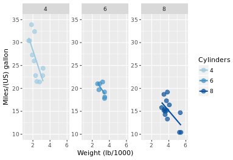
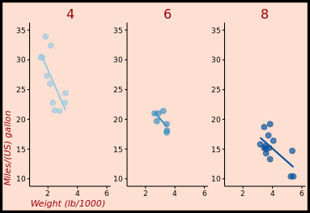
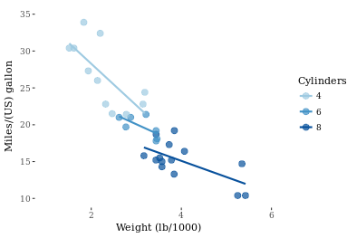
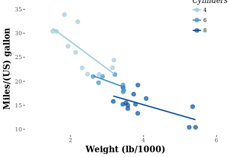

#### Note: the object z2 was provided by DataCamp


#### Load the knitr package
```{r}
library(knitr)
```


## Updating themes 

#### Object z2
```{r  out.width = "50%"}
 
```

#### Theme layer saved as an object, theme_pink
theme_pink <- theme(panel.background = element_blank(),  
                    legend.key = element_blank(),  
                    legend.background = element_blank(),  
                    strip.background = element_blank(),  
                    plot.background = element_rect(fill = myPink, color = "black", size = 3),  
                    panel.grid = element_blank(),  
                    axis.line = element_line(color = "black"),  
                    axis.ticks = element_line(color = "black"),  
                    strip.text = element_text(size = 16, color = myRed),  
                    axis.title.y = element_text(color = myRed, hjust = 0, face = "italic"),  
                    axis.title.x = element_text(color = myRed, hjust = 0, face = "italic"),  
                    axis.text = element_text(color = "black"),  
                    legend.position = "none")  

#### Apply theme_pink to z2
z2 + theme_pink
```{r  out.width = "50%"}
 
```

#### Change code so that old theme is saved as old
old <- theme_update()

#### Display the plot z2
z2
```{r  out.width = "50%"}
include_graphics("images/updating_themes_2.png") 
```

#### Restore the old plot
theme_set(old)


## Exploring ggthemes

#### Load ggthemes package
library(ggthemes)

#### Apply theme_tufte
z2 + theme_tufte()
```{r  out.width = "50%"}
 
```


#### Apply theme_tufte, modified:
z2 + theme_tufte() +  
  theme(legend.position = c(0.9, 0.9),  
        legend.title = element_text(face = "italic", size = 12),  
        axis.title = element_text(face = "bold", size = 14))  
```{r  out.width = "50%"}
 
```