#### Note: the object z was provided by DataCamp


#### Load the knitr package
```{r}
library(knitr)
```


## Rectangles 

#### Object z
```{r  out.width = "50%"}
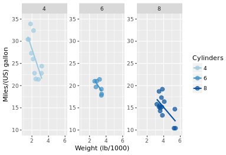 
```

#### Plot 1: change the plot background color to myPink:
z + theme(plot.background = element_rect(fill = myPink))
```{r  out.width = "50%"}
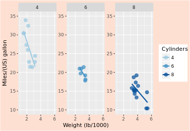 
```

#### Plot 2: adjust the border to be a black line of size 3
z + theme(plot.background = element_rect(fill = myPink, color = "black", size = 3))
```{r  out.width = "50%"}
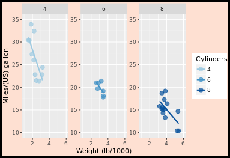 
```

#### Plot 3: set panel.background, legend.key, legend.background and strip.background to element_blank()
uniform_panels <- theme(panel.background = element_blank(),  
                        legend.key = element_blank(),  
                        legend.background=element_blank(),  
                        strip.background = element_blank())  

z + theme(plot.background = element_rect(fill = myPink, color = "black", size = 3)) +  
  uniform_panels  
```{r  out.width = "50%"}
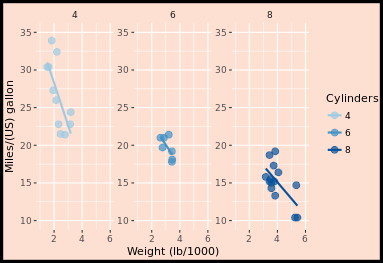 
```

## Lines 

#### Extend z with theme() function and three arguments
z +  
  theme(panel.grid = element_blank(),  
        axis.line = element_line(color = "black"),  
        axis.ticks = element_line(color = "black"))  
```{r  out.width = "50%"}
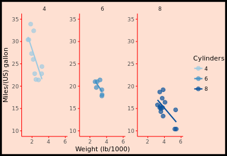 
```


## Text 

#### Extend z with theme() function and four arguments
z +  
  theme(strip.text = element_text(size = 16, color = myRed),  
        axis.title.y = element_text(color = myRed, hjust = 0, face = "italic"),  
        axis.title.x = element_text(color = myRed, hjust = 0, face = "italic"),  
        axis.text = element_text(color = "black"))  
```{r  out.width = "50%"}
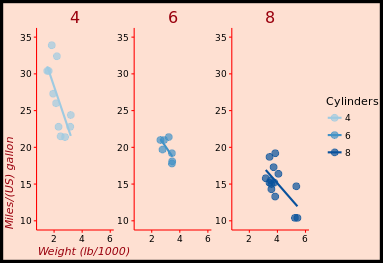 
```


## Legends 

#### Move legend by position
z + theme(legend.position = c(0.85, 0.85))
```{r  out.width = "50%"}
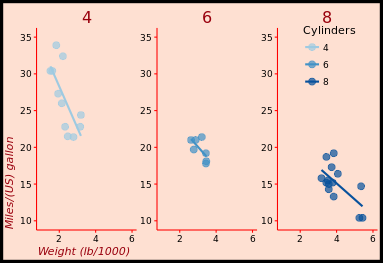 
```

#### Change direction
z + theme(legend.direction = "horizontal")
```{r  out.width = "50%"}
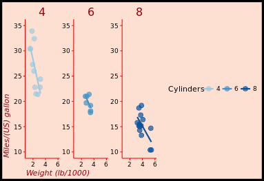 
```

#### Change location by name
z + theme(legend.position = "bottom")
```{r  out.width = "50%"}
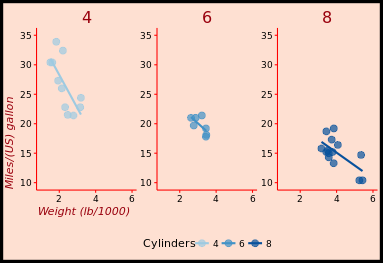 
```

#### Remove legend entirely
z + theme(legend.position = "none")
```{r  out.width = "50%"}
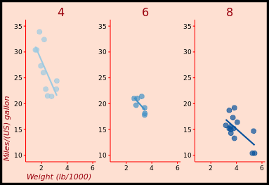 
```


## Positions 

#### Increase spacing between facets
library(grid)  
z + theme(panel.spacing.x = unit(2, "cm"))
```{r  out.width = "50%"}
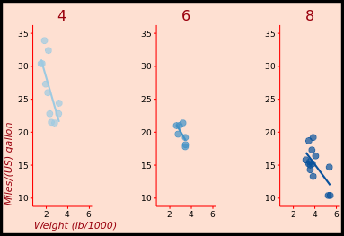 
```

#### Add code to remove any excess plot margin space
z +  
  theme(panel.spacing.x = unit(2, "cm"),   
        plot.margin = unit(c(0,0,0,0), "cm"))  
```{r  out.width = "50%"}
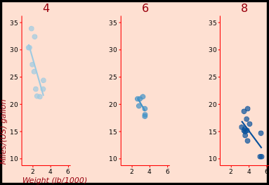 
```