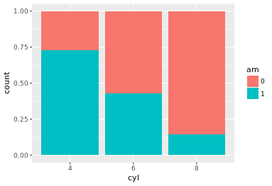

#### Load the ggplot2 package
```{r}
library(ggplot2)
```

#### Load the knitr package
```{r}
library(knitr)
```

#### Change cyl inside mtcars to a factor
```{r}
mtcars$cyl <- as.factor(mtcars$cyl) 
```

#### Change am inside mtcars to a factor
```{r}
mtcars$am <- as.factor(mtcars$am) 
```


## Pie charts (1)

#### Bar chart
```{r  out.width = "50%"}
 
```

#### Convert bar chart to pie chart
```{r  out.width = "50%"}
ggplot(mtcars, aes(x = factor(1), fill = am)) +
  geom_bar(position = "fill", width = 1) + 
  facet_grid(. ~ cyl) + 
  coord_polar(theta = "y")
```


## Pie charts (2)

#### Parallel coordinates plot using GGally
```{r}
library(GGally)
```

#### All columns except am
```{r}
group_by_am <- which(colnames(mtcars) == "am")
my_names_am <- (1:11)[-group_by_am]
```

#### Basic parallel plot - each variable plotted as a z-score transformation
```{r  out.width = "50%"}
ggparcoord(mtcars, my_names_am, groupColumn = group_by_am, alpha = 0.8)
```